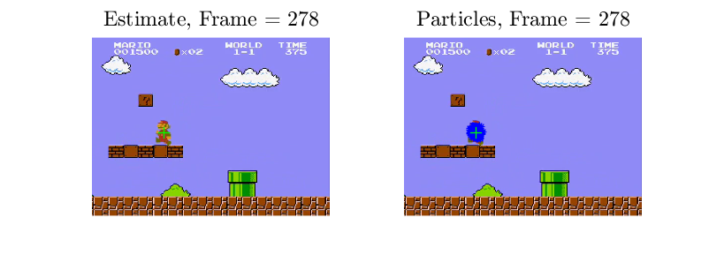

# Applied Estimation - Super Mario
### ARTHURS:
Ilian Corneliussen, Andrej Wilczek & Daniel Hirsch.
### PROBLEM DESCRIPTION:
We will preform visual tracking of Mario in 
Super Mario games. We will attempt an implementation of both a
particle filter and Kalman filter. After implementation a comparative 
analysis of the two filters performance in terms of relevant criteria 
such as errors and computational speed will then be preformed in order 
to evaluate the results. Before applying the filters various image 
processing will be done, such as colour filtering, grey scaling, etc.

||
|:--:|
|*Particle Filter Results*|

